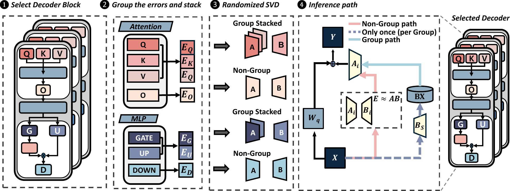

# GlowQ: Group-Shared LOw-Rank Approximation for Quantized LLMs



[](https://arxiv.org/abs/2603.25385) [](https://github.com/ahnselim/GLOWQ)

GlowQ is a low-rank correction method for quantized LLMs that reduces the latency and memory overhead of conventional per-layer restoration by sharing and caching a single right-factor projection across modules that consume the same input (e.g., QKV or MLP groups).

GlowQ-S is a selective variant that applies these cached shared corrections only to the groups/layers with the highest accuracy benefit, preserving most of the quality gains while further improving inference efficiency.

## Installation

Anaconda/Miniconda is recommended.

### 1. Create Conda Environment

```bash
cd GlowQ
conda env create -f environment.yml
conda activate glowq
python -m pip install --upgrade pip
```

### 2. Install PyTorch (CUDA-enabled)

Install a PyTorch build that matches your CUDA runtime/driver environment.

Example (pip, CUDA 12.1 wheels):

```bash
pip install torch torchvision torchaudio --index-url https://download.pytorch.org/whl/cu121
```

If you only want a quick CPU-side smoke test (not recommended for full pipeline runtime):

```bash
pip install torch torchvision torchaudio
```

### 3. Notes on Packages Installed by `environment.yml`

`environment.yml` installs the non-PyTorch dependencies used by the GlowQ pipelines (Transformers, Datasets, plotting, Triton, `lm-eval`, etc.).

PyTorch is intentionally installed separately in Step 2 so you can choose a CUDA-matching build.

## CUDA Setup Notes

### Recommended Approach (Most Users)

Use a CUDA-enabled PyTorch wheel (as above). This is usually enough to run the main pipeline without installing a full system CUDA toolkit manually.

### When You Also Need CUDA Toolkit (`nvcc`)

If you enable the custom CUDA extension path (e.g., `use_cuda_w4a16 = true`), you will need to build the CUDA extension (recommended) or allow runtime JIT fallback. In either case, install a matching CUDA Toolkit on the system.

Checklist:

- NVIDIA driver is installed and `nvidia-smi` works.
- `torch.cuda.is_available()` returns `True`.
- `nvcc --version` is available (for CUDA extension builds).
- CUDA Toolkit version is compatible with the PyTorch CUDA build you installed.

Useful checks:

```bash
nvidia-smi
nvcc --version
python - <<'PY'
import torch
print("torch:", torch.__version__)
print("cuda available:", torch.cuda.is_available())
print("torch CUDA build:", torch.version.cuda)
PY
```

If CUDA extension build fails, set `CUDA_HOME` to your toolkit path (example):

```bash
export CUDA_HOME=/usr/local/cuda
export PATH=$CUDA_HOME/bin:$PATH
export LD_LIBRARY_PATH=$CUDA_HOME/lib64:$LD_LIBRARY_PATH
```

### Using the Custom CUDA W4A16 Kernel (Step3)

GlowQ's W4A16 path uses a custom CUDA extension in `src/cuda_w4a16/`.

Current default behavior is **prebuilt extension import** (recommended), not runtime JIT build.

#### Build the CUDA Extension (Recommended)

Build once (or rebuild after editing CUDA sources):

```bash
cd GlowQ/src

# Set CUDA arch explicitly if auto-detection is unreliable on your server
# Example for A100: 8.0
export TORCH_CUDA_ARCH_LIST=8.0

python setup_cuda_w4a16.py build_ext --inplace
```

This produces a compiled module under:

- `GlowQ/src/cuda_w4a16/w4a16_kernels*.so`

Optional build knobs:

```bash
export MAX_JOBS=8            # parallel compile jobs (ninja)
export CUDA_HOME=/usr/local/cuda
```

#### Enable It in Step3

1. Build the extension (above).
2. In your config (`.toml`), set `use_cuda_w4a16 = true`.
3. Run the pipeline as usual (for example, `python run_glowq.py qwen_2_5_7b.toml`).

Expected Step3 log when enabled:

- `Converting model to CUDA W4A16...`

If import/build fails:

- Confirm `nvcc --version` works and matches your CUDA/PyTorch environment.
- Confirm `CUDA_HOME` is set correctly (see example above).
- Rebuild after CUDA source changes: `python setup_cuda_w4a16.py build_ext --inplace`

#### Optional Runtime JIT Fallback (Debug/Dev Only)

If you intentionally want the old runtime JIT fallback path:

```bash
export W4A16_ALLOW_JIT=1
```

Then the extension can fall back to `torch.utils.cpp_extension.load(...)` when the prebuilt module is missing.

## Pipelines

GlowQ currently provides two pipeline entry points:

- `run_glowq.py`: main GlowQ pipeline (`step1 -> step2 -> step3`)
- `run_glowq_s.py`: restoration pipeline (`step1 -> step2 -> step3_1 -> step4 -> step5`)

Both scripts take one argument `CONFIG` (a TOML file path or a file name under `./configs`).

## Entry Points

### Main GlowQ Pipeline

`run_glowq.py` executes:

- Step1: quantization error extraction
- Step2: randomized GSVD / shared low-rank artifact generation
- Step3: evaluation (`step3_eval_dataset.py` or `step3_lm_eval.py`)

Run with:

```bash
python run_glowq.py configs/qwen_2_5_7b.toml
```

You can also pass only the config filename:

```bash
python run_glowq.py qwen_2_5_7b.toml
```

### GlowQ-S Pipeline

`run_glowq_s.py` executes:

- Step1: restoration quantization error extraction
- Step2: restoration randomized GSVD
- Step3_1: importance ranking computation
- Step4: cumulative restoration evaluation
- Step5: final comparison plot generation

Run with:

```bash
python run_glowq_s.py configs/qwen_2_5_7b.toml
```

Recent update:

- `step3_1` importance ranking now supports configurable metrics from TOML via `importance_metric`.
- Default metrics are `gsvd,norm_error` (GSVD score + normalized error ratio).

## Configuration

Config templates are in `./configs/`.

Examples:

- `configs/qwen_2_5_7b.toml`
- `configs/llama_3_2_3b.toml`
- `configs/mistral_7b.toml`

Typical fields include:

- `model_name`
- `svd_rank`
- `calibration_dataset`
- `calibration_n_samples`
- `ppl_dataset`
- `lm_harness`
- `device`
- `group_size`
- `use_cuda_w4a16`
- `trust_remote_code`
- `output_dir`
- `glowq_s` (optional; marker flag for restoration pipeline configs)
- `importance_metric` (optional; used by `run_glowq_s.py` Step3_1)

To use the custom CUDA W4A16 kernel path in Step3, set `use_cuda_w4a16 = true` in your config (TOML). If this is `false`, GlowQ uses the default Triton 4-bit path (or FP16 fallback when Triton is unavailable).

### GlowQ-S Importance Metrics (Step3_1)

`run_glowq_s.py` reads `importance_metric` from the TOML config and passes it to `src/restoration/step3_1_calculate_importance.py`.

Default:

```toml
glowq_s = true
importance_metric = "gsvd,norm_error"
```

Supported metrics (comma-separated):

- `gsvd`
- `norm_error`
- `frobenius_norm_error`
- `cosine_similarity`
- `layer_order`

Useful aliases are also accepted (for example: `norm`, `normalized`, `fro`, `cosine`, `layer`).

### LM Harness Mode

If `lm_harness = true` in config, `run_glowq.py` step3 uses `src/step3_lm_eval.py`, which requires `lm-eval`.

## Output Structure

### Main Pipeline (`run_glowq.py`)

Default output directory:

```text
GlowQ/outputs/<config_stem>/
```

Typical artifacts:

```text
step1/
  quant_error.pt
  original_weights.pt
step2/
  low_rank_shared.pt
  b_ref_map.json
logs/
  step2_rsvd.log
```

### GlowQ-S Pipeline (`run_glowq_s.py`)

Default output directory:

```text
GlowQ/outputs/<config_stem>/restoration/
```

Typical artifacts:

```text
step1/
  quant_error.pt
  original_weights.pt
step2/
  low_rank_shared.pt
  b_ref_map.json
step3_1/
  importance_rankings.json
step4/
  cumulative_results.csv
step5/
  final_ppl_comparison_plot.png
```

## Minimal Workflow Example

```bash
conda activate glowq

# Main pipeline
python run_glowq.py qwen_2_5_7b.toml

# Restoration pipeline (optional)
python run_glowq_s.py qwen_2_5_7b.toml
```

## Troubleshooting

- `Triton is not installed`: install `triton`, or run paths that allow Triton-disabled fallback.
- `lm-eval-harness not available`: install `lm-eval` and set `lm_harness = true` only when needed.
- CUDA extension build/runtime issues: verify `nvidia-smi`, `nvcc --version`, and PyTorch CUDA compatibility.
- Hugging Face model loading errors with community models: set `trust_remote_code = true` in the config when required.

## Cite

```bibtex
@inproceedings{
an2026glowq,
title={GlowQ: Group-Shared {LO}w-Rank Approximation for Quantized {LLM}s},
author={Selim An and Il hong Suh and Yeseong Kim},
booktitle={The Fourteenth International Conference on Learning Representations},
year={2026},
url={https://openreview.net/forum?id=kVojSLUcvS}
}

```
